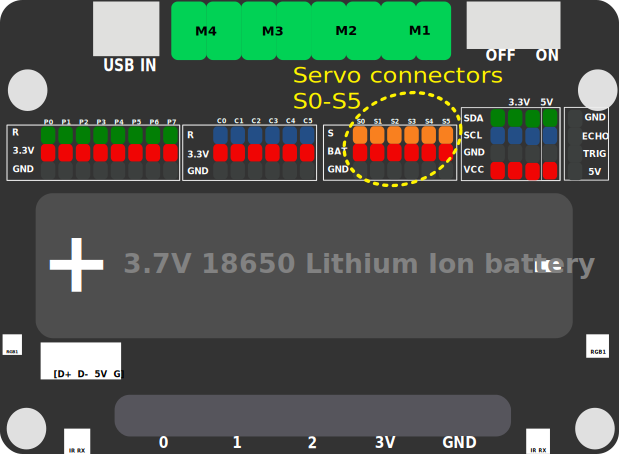
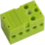
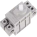
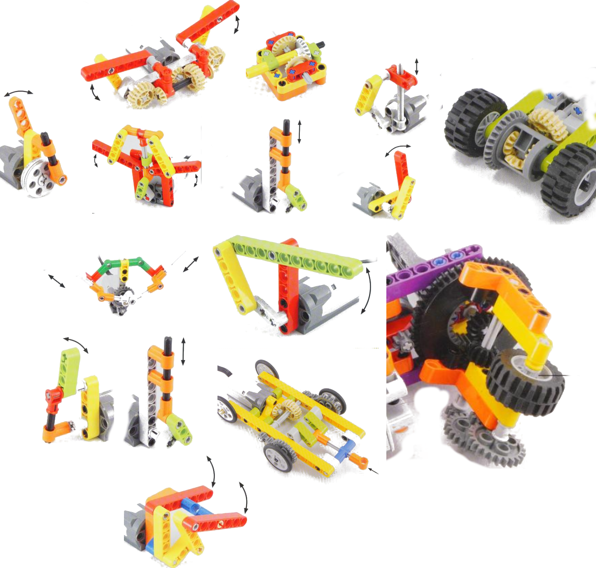

# READ THIS FIRST!
We strongly recommend to read this document before jumping in contest :)

#  Introduction

This document is your practical guide for the D4A contest.
It covers the essential steps to build a functional bot using the elements and win the contest.

# Bill of material
You should have received: 
* 1 microcontroller board with screen and camera

* 1 extension board, with a battery holder, lots of pins, **power switch** and **USB connector** for battery charging.

* 1 battery 18650 (loaded). **Be extremely carefull with polarity when plugin the battery**
* 1 set of lego bricks with plates, wheels, axles, tracks, gears.  ~[book_chapters.png](book_chapters.png)
* 2 servo motors : green ones 

* 2 angular servos : grey  ones 

* 1 toothpicks
* 1 balloon

# Contest objective
Build the best remote controlled bot, a champion that will keep its balloon longer than others. 

# Participant guide
You'll have to design and assemble your own bot with the provided pieces.

Electronics is very easy you just have to 
- plug the microcontroller board in the extension board
- plug the servos you want to use to extension board pins S0 to S5 at your convenience.

Controlling your bot will be done via your computer using your keyboard, mouse, joystick or pure code. 

## Building your bot

### Contraints
1. The electronics parts have to be protected from toothpicks (using transparent sheet or lego pieces)
1. The camera field of view must be free of obstacle (~90 degrees)
1. The balloon has to be firmly mounted in a location that can be accessed to other bots : it must be in contact with the ground.

### Moving your bot
Most common way are here under:

#### Tank mode
One motor on left track, one right track. 
Motors running in same direction => going forward / backward.
Motors running in opposite direction => turning on itself.

#### Dicycle 
One motor on left wheel, one on right wheel, a third free wheel for stability
Motors running in same direction => going forward / backward.
Motors running in opposite direction => turning on itself.

#### Tricycle 
One motor on the differential in and two wheels on the differential out, one angular servo on direction wheel.
Close but simplier than a car.

#### Car
One motor on the differential in and two wheels on the differential out, angular servo controls two direction wheels.
Like a car. 

#### ... 
There are plenty of other ways to nove your bot: be creative.

### Motor control

Motor speed can be set from -100 to +100. 
You may find some benefits using the gears to multiply rotation speed.

Mounting Motors may be tricky as holes are not symetrical on the box : some holes are 1/2 depth.

### Angle control

Angular servo be set from 0 to 270 degree.
 

### Mounting the toothpick
There are lots of ways to mount your tooth picks:
- static at end of a pole
- attached at end of and articulated arm
- ...

### Mounting your balloon
You balloon has to be fairly mounted in a location that can be accessed to other bots. Loosing your balloon is a cause of defeat.

### Tips an tricks
- triple check the battery polarity before inserting and powering. 
- double check the servo connection direction
- Let the USB-c connector accessible
- Use the USB-c connector to charge the battery
- Let the power switch accessible
- Be iterative
- If you lack ideas, have a look at the book [The LEGO power functions idea book., Isogawa, Yoshihito](https://archive.org/details/legopowerfunctio0000isog_f2e0/page/4/mode/2up) : there are lots of ideas .

## Coding part

### Contest firmware.
The microcontroller is provided with a custom firmware for the contest.

#### Setup WiFi (optional)

On first boot, if no known WiFi is accessible, board will open its own access point `amaker-XXXXX` and show its name on screen. Connect to it using password `amaker-club`.
Once connected, open page [http://192.168.4.1](http://192.168.4.1)

The home page allows to configure a "public" WiFi access point to use:
- set master token (it's present on screen), click register
- define WiFi SSID and password and save.
- reboot to start using this WiFi network.

#### Website (port 80)
The microcontroller exposes a website on port 80.
It exposes the Wifi setup page, the camera view page, a the online javascript controller coding page.

#### WebSocket (port 81)
The microcontroller exposes a website on port 81.
Only for 

#### UDP (port 24642)
The microcontroller exposes a UDP service on port 24642.

### Coding your controller

#### Easy mode
You can code all your interactions from keyboard and joystick to board using thonline javascript. Code example are provided. 

#### Code your own client
You can code your own controller with your own code that will interact via  websocket or UDP with the bot relying on given firmware. 
No example but but the online javascript. Documentation of service is provided.

#### Code your own firmware 
You can code your own firmware using VisualStudio and PlatformIO, but you'd better forget about cloning the code repo a starting this.

