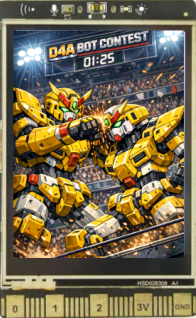

# Board UI User Guide

The K10 Bot has a built-in **240 × 320 px TFT screen** and a **Button A** that let you monitor and navigate the device without a computer.

---

## Button A — Screen navigation

Press **Button A** (on the UniHiker K10 board) to cycle forward through all screens.  
Navigation wraps from the last screen back to the first.  
A 250 ms debounce prevents accidental double-presses.

The same navigation is also available remotely from the web UI (**📝 Play** page → K10 Display section) or via binary protocol commands (see [binary-protocol.md](binary-protocol.md)).

---

## Screens

| # | Name | Class | Content |
|---|---|---|---|
| 0 | Splash | SplashScreen | Boot image — shown once at startup |
| 1 | App Info | AppScreen | Live dashboard (default after splash) |
| 2 | App Log | LogScreen | Application / bot message log |
| 3 | Svc Log | LogScreen | Service lifecycle log |
| 4 | Debug Log | LogScreen | Verbose debug log |
| 5 | ESP Log | LogScreen | ESP-IDF system log |

---

## Screen 0 — Splash

Displayed at boot. Shows the splash image :)
Automatically advances to **App Info** after **10 seconds** (or immediately if Button A is pressed).

---

## Screen 1 — App Info (dashboard)

The main diagnostic screen, refreshed every **500 ms**. It is divided into five fixed panels.

### Panel 1 — Network & Master  *(top of screen)*

| Row | Label | Value |
|---|---|---|
| 1 | *(title)* | **aMaker Bot** — coloured by service health¹ + bot name |
| 3 | SSID | Connected WiFi network name |
| 4 | IP | Bot's IP address |
| 5 | Hostname | mDNS hostname |
| 6 | UDP port | 24642 (fixed) |
| 7 | WebSocket port | 81 (fixed) |
| 8 | HTTP port | 80 (fixed) |
| 9 | Master | `REG: XXXXX` when no master registered² — or master's IP when one is active |

¹ Title row colours:

| Colour | Meaning |
|---|---|
| 🟢 Green | Service STARTED (normal operation) |
| 🟡 Yellow | Service INITIALIZED (not yet started) |
| 🔴 Red | Service STOPPED or ERROR |

² **`REG: XXXXX`** — the 5-character token you must enter to register as master. It is randomly generated each boot.

---

### Panel 2 — Communication Counters  *(middle of screen)*

Three rows showing live packet counts for each transport:

| Column | Content |
|---|---|
| Services | Transport name (UDP / Web / WSocket) |
| #in | Frames received since boot |
| #out | Frames sent since boot |
| #drop | Frames dropped (parse errors, auth failures) |

---

### Panel 3 — Servo Table  *(lower left)*

Shows the state of all **6 servo channels** (S0–S5):

| Column | Content |
|---|---|
| S*n* | Channel index |
| Type | `---` = unattached / SERVO_180, `270` = SERVO_270, `rot` = continuous rotation |
| Angle | Current cached angle in degrees (signed) |

Header row colour reflects `MotorServoService` health (same green/yellow/red scheme as Panel 1).

---

### Panel 4 — Motor Table  *(lower right)*

Shows the state of all **4 DC motor channels** (M1–M4):

| Column | Content |
|---|---|
| M*n* | Motor index |
| Speed | Current cached speed: −100 (full reverse) → 0 (stopped) → +100 (full forward) |

---

### Panel 5 — Battery Icon  *(far right, beside motor table)*

A vertical battery-shaped icon filled from the bottom up:

| Fill colour | Charge |
|---|---|
| 🟢 Green | ≥ 65 % |
| 🟡 Yellow | 35 – 64 % |
| 🟠 Orange | 20 – 34 % |
| 🔴 Red | < 20 % |

---

### Panel 6 — ESP Info  *(bottom of screen)*

| Row | Content |
|---|---|
| 1 | Chip model, CPU frequency, core count |
| 3 | Free heap — percentage + bytes |
| 4 | Free PSRAM — percentage + bytes |

---

## Screens 2 – 5 — Log Screens

All four log screens share the same layout:

- **Cyan title bar** at the top (e.g. `2: App Log`)
- **Scrolling log lines** below — newest at the bottom, oldest scrolled off the top
- **40 characters × 39 visible lines** (font-1 at 1×)
- Each line is colour-coded by log level:

| Colour | Log level |
|---|---|
| White | INFO |
| Grey | DEBUG |
| Red | ERROR |
| Cyan | (system / service messages) |

The screen only redraws when the attached logger receives a new entry (version-based update detection — no wasted repaints).

| Screen | Logger | Typical content |
|---|---|---|
| 2: App Log | `bot_logger` | Incoming commands, registration events, heartbeats |
| 3: Svc Log | `svc_logger` | Service start/stop, WiFi state changes |
| 4: Debug Log | `debug_logger` | Verbose protocol traces (enabled with `VERBOSE_DEBUG`) |
| 5: ESP Log | `esp_logger` | Raw ESP-IDF system messages |

---

## LED indicators

The three **NeoPixel RGB LEDs** (indices 0 – 2) on the K10 board are used during **service startup** to show initialization progress on **LED 0**:

| Colour | Meaning |
|---|---|
| 🔴 Red | Service is being initialized |
| 🟡 Yellow | Service initialized — attempting to start |
| 🟢 Green *(brief flash)* | Service started successfully |
| ⚫ Off | Startup failed — or normal idle state |

LEDs 1 and 2 are available for user control via `LEDService` binary protocol commands (see [binary-protocol.md](binary-protocol.md)).

---

*See also: [architecture.md](architecture.md) · [web-ui.md](web-ui.md) · [quickstart.md](quickstart.md)*
